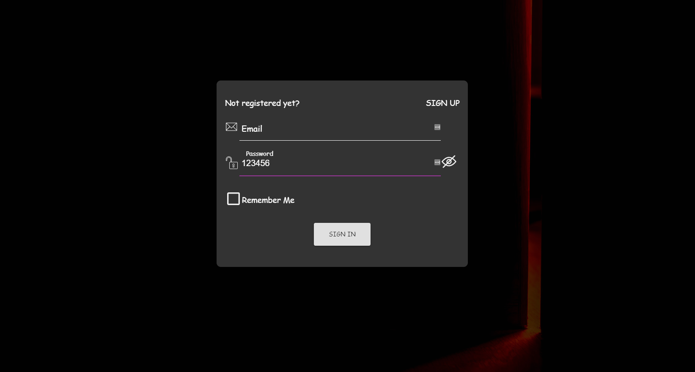
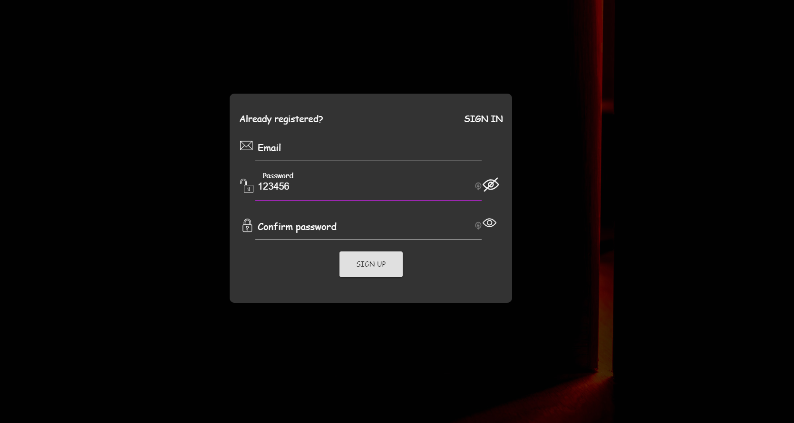
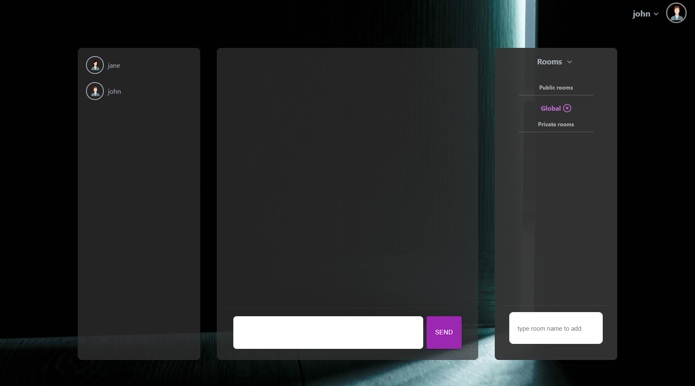
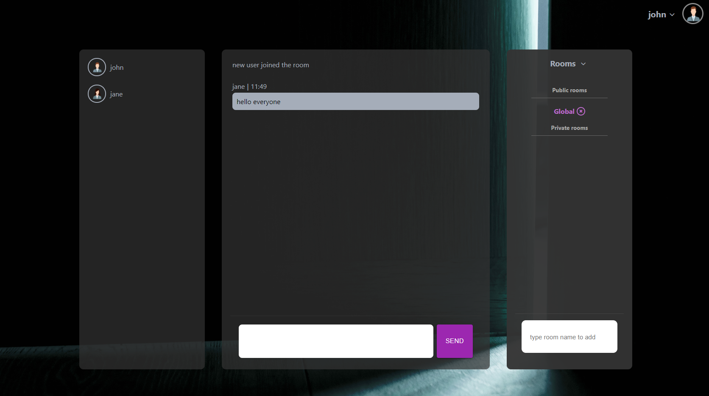
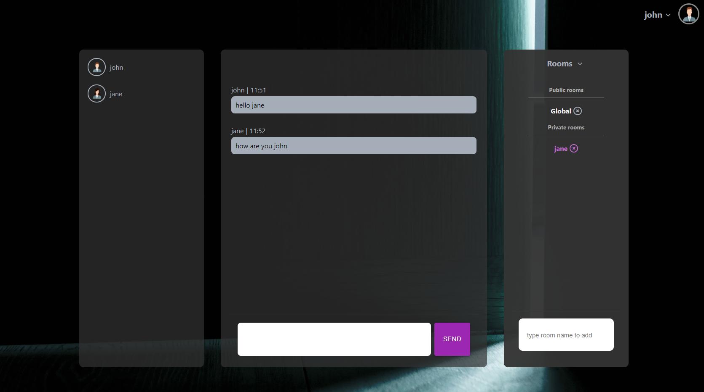

## Chatroom with nodeJs and Mongodb and ReactJs

### This chatroom using nodeJs and mongodb for server and ReactJs for the client side and also uses Socket.io and hashes password and use json web token for authentication

### To start server use ```yar dev``` in server directory

### To start client use ```yarn start``` in client directory

### To change the ```default room name``` and ```port number``` and ```secret code``` change ```.env``` file

### At first the start page will be shown


### After clicking on start button, The login page will be show. If user select the remember me checkbox the session won't be destroyed when closing the browser tab and the user will stay signed in



### If the user are a new user the user should register with a unique email address. At first the user will have a default username and avatar that the user can change later in the profile page.



### After login the chatroom will be shown and by default the user will join the default Global room





### The user can join or leave other rooms or the user can create new rooms


### The users can have private chat that should be approved by the receiver first



### In the profile page the user can change their avatar, unique username or password

